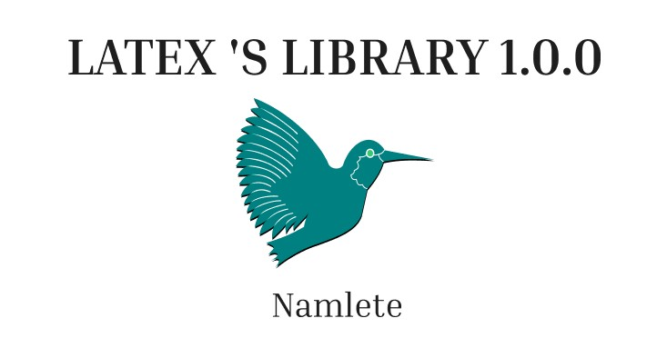

# latex-web

(cái này sẽ xây dựng sau khi hoàn thành xong việc soạn bài học) 

Thiết kế banner bằng Figma dựa trên ý tưởng làm thumbnail từ video âm nhạc của ca sĩ Sufjan Stevens (ý tưởng là vậy chứ lúc làm nhìn chán ác): https://www.figma.com/design/E5loNfD3k4lmooZqjzpNnj/B%C3%ADa-s%C3%A1ch?node-id=1-2&t=GmiSaoQKrySqJyb4-1 

	

Mục tiêu căn bản là tạo web để chứa các bài học LaTeX đây (đi theo con đường biên soạn sách điện tử). 

Mã nguồn tạo web (đang trong quá trình thử nghiệm): . . . (chưa cập nhật)

Để tạo được web, tự học HTML, CSS, Git and Github, Visual Studio Code cơ bản. (JS mình ăn cắp trên mạng hehe :>)

Trang tham khảo mẫu thiết kế: 
+ https://bellard.org/index.html  (trang web của Fabrice Bellard) và https://www.mit.edu/~ashrstnv/maxwells-equations.html (trang web của MIT)
+ https://www.learnlatex.org/vi/lesson-03  (trang web hướng dẫn LaTeX sử dụng TeXlive.net) 
+ https://github.com/davidcarlisle/latexcgi  (mã nguồn tạo TeXlive.net) 

Trong trang web đó cần chứa: 
+ Chắc chắn phải chứa các bài học [Lecture notes]() ở mỗi chủ đề khác nhau trong LaTeX (bao gồm phiên bản web và phiên bản pdf (được viết ở lớp report thô sơ trước))
+ Giới thiệu tài liệu học và cảm ơn những tài liệu hay ai đó mà mình tham khảo, học được từ đó (Introduction and Thank you)
+ Hướng dẫn đọc tài liệu của mình 
+ Giới thiệu một chút thằng tác giả: Ngắn gọn thoi (About)
    Nguyễn Lê Nam (Namlete) một thằng lông bông sinh năm 2007. 
+ Giới thiệu sơ qua các web chính chứa những phần trên (bổ sung thêm có phần **news** để chứa những cập nhật mới nhất về dự án)